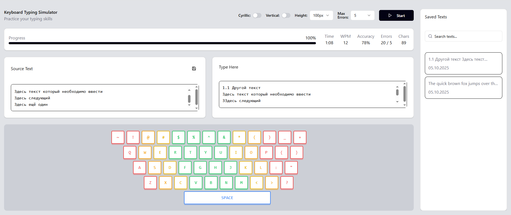

# Симулятор клавиатуры для обучения печати

Это веб-приложение для обучения и практики слепой печати с визуализацией клавиатуры и статистикой.

## Возможности

- **Двуязычная поддержка**: Переключение между латинской и кириллической раскладками
- **Визуализация клавиатуры**: Интерактивная клавиатура с цветовой индикацией нажатых клавиш
- **Статистика в реальном времени**: 
  - Скорость печати (WPM)
  - Точность (Accuracy)
  - Количество ошибок
  - Прогресс выполнения
  - Время сессии
- **Настройка ограничений**: Настраиваемое максимальное количество ошибок
- **Сохранение текстов**: Возможность сохранять и загружать тексты для практики
- **Гибкий интерфейс**: 
  - Переключение между горизонтальной и вертикальной компоновкой
  - Настраиваемая высота областей ввода
- **Автоматическое завершение**: Автоматическая остановка при достижении лимита ошибок или завершении текста

## Скриншот приложения



## Технологии

- **React 18** - Основной фреймворк
- **TypeScript** - Типизация
- **Vite** - Сборщик и dev-сервер
- **Tailwind CSS** - Стилизация
- **Radix UI** - UI компоненты
- **Lucide React** - Иконки

## Установка и запуск

### Предварительные требования
- Node.js (версия 16 или выше)
- npm или yarn

### Установка зависимостей
```bash
npm install
```

### Запуск в режиме разработки
```bash
npm run dev
```

### Сборка для продакшена
```bash
npm run build
```

### Предварительный просмотр сборки
```bash
npm run preview
```

## Использование

1. **Ввод текста**: Введите или вставьте текст в область "Source Text"
2. **Настройка параметров**:
   - Переключите раскладку клавиатуры (Латинская/Кириллическая)
   - Выберите компоновку интерфейса (Горизонтальная/Вертикальная)
   - Установите высоту областей ввода
   - Настройте максимальное количество ошибок
3. **Начало практики**: Нажмите кнопку "Start" и начните печатать
4. **Сохранение текстов**: Используйте кнопку сохранения для сохранения текстов для будущего использования

## Особенности интерфейса

- **Цветовая индикация**: Правильно набранные символы выделяются зеленым, ошибки - красным
- **Визуализация клавиш**: Нажатые клавиши подсвечиваются соответствующими цветами пальцев
- **Статистика**: Отображение прогресса и показателей в реальном времени
- **Адаптивность**: Интерфейс адаптируется под различные размеры экрана

## Лицензия

MIT License

## Автор

Kolelan@yandex.ru
